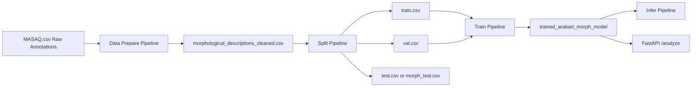

# Arabic Morphology with AraBART

Arabic morphology pipeline using AraBART, with reproducible training/inference workflows and FastAPI serving.

## Overview
This repository fine-tunes `moussaKam/AraBART` to generate structured Arabic morphology descriptions from token input.  
It includes:
- data preparation from MASAQ-style annotations
- deterministic train/val/test pipeline
- model training + checkpoint export
- inference CLI and API serving
- tests + CI for baseline maintainability

## Architecture


## Quickstart

### 1) Environment Setup
```bash
python -m venv .venv
source .venv/bin/activate  # Windows: .venv\Scripts\activate
pip install -r requirements.txt
```

### 2) Data Preparation
```bash
python -m src.pipelines.prepare_pipeline
python -m src.pipelines.split_pipeline
```

### 3) Model Training
```bash
python -m src.pipelines.train_pipeline
```

### 4) Evaluation / Inference
```bash
python -m src.pipelines.eval_pipeline --max-samples 100
python -m src.pipelines.infer_pipeline --text "الكتاب جميل"
```

### 5) API Serving
```bash
uvicorn main:app --reload
```

## Docker
Build:
```bash
docker build -t arabic-morphology-arabart .
```

Run:
```bash
docker run --rm -p 8000:8000 \
  -e ARABART_MODEL_DIR=/app/trained_arabart_morph_model \
  -v $(pwd)/trained_arabart_morph_model:/app/trained_arabart_morph_model \
  arabic-morphology-arabart
```

## Repo Structure
```text
.
├─ docs/
├─ src/
│  ├─ api/
│  ├─ config/
│  ├─ data/
│  ├─ models/
│  ├─ pipelines/
│  └─ utils/
├─ tests/
├─ scripts/
├─ prepare_dataset.py   # legacy wrapper
├─ split_dataset.py     # legacy wrapper
├─ train_model.py       # legacy wrapper
└─ main.py              # legacy API entry wrapper
```

## Reproducibility
- Default config: `src/config/default.yaml`
- Global seed: configurable (default `42`)
- Legacy compatibility: original root scripts kept as thin wrappers

## Artifacts Not Tracked by Git
Large datasets and model checkpoints are intentionally excluded (see `.gitignore`):
- `MASAQ.csv`
- `morphological_descriptions_cleaned.csv`
- `data_ready/`
- `trained_arabart_morph_model/`

To reproduce:
1. Place raw MASAQ data at `MASAQ.csv`.
2. Run prepare/split/train pipelines.
3. Use exported model for API/inference.


## Documentation
- `docs/system-design.md`
- `docs/data-card.md`
- `docs/model-card.md`
- `docs/experiments.md`
- `docs/api.md`
